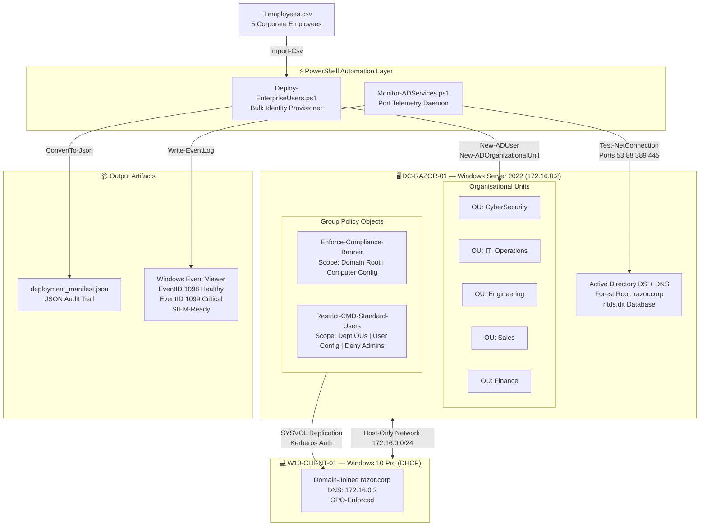

<div align="center">

# 🏰 Orchestra-AD
### Enterprise Active Directory Provisioning Lab | PowerShell Infrastructure-as-Code

[](https://learn.microsoft.com/en-us/powershell/)
[](https://www.microsoft.com/en-us/windows-server)
[](https://learn.microsoft.com/en-us/windows-server/identity/ad-ds/get-started/virtual-dc/active-directory-domain-services-overview)
[](LICENSE)
[]()

**A production-grade, fully-automated Active Directory Domain Services home lab built with PowerShell Infrastructure-as-Code. Demonstrates enterprise identity management, dynamic OU provisioning, Group Policy enforcement, and continuous AD service telemetry — all driven by script, zero GUI clicks.**

[Architecture](#-architecture) · [Scripts](#-scripts) · [Quick Start](#-quick-start) · [Verification](#-verification) · [Key Concepts](#-key-learning-outcomes) · [Blog Post](#-blog-post)

</div>

---

## 📋 Project Overview

This project showcases the transition from **manual GUI administration to PowerShell-driven Infrastructure-as-Code** in an enterprise Active Directory environment. Two core automation scripts replace hours of repetitive ADUC work with a repeatable, parameterised, and auditable provisioning pipeline.

| Component | Technology | Role |
|-----------|-----------|------|
| Domain Controller | Windows Server 2022 AD DS | Forest root: `razor.corp` · IP: `172.16.0.2` |
| DNS | AD-integrated Windows DNS | SRV record–based service discovery |
| Identity Provisioning | `Deploy-EnterpriseUsers.ps1` | Bulk user + OU creation from CSV manifest |
| Service Monitoring | `Monitor-ADServices.ps1` | Continuous TCP port telemetry daemon |
| Access Control | Group Policy Objects (GPOs) | Login banner enforcement, CMD restriction |
| Audit Trail | JSON manifest + Windows Event Viewer | Deployment records + SIEM-ready event log |
| Client Endpoint | Windows 10 Pro | Domain-joined, GPO-enforced, Kerberos-authenticated |

---

## 🗺️ Architecture



---

## 🛠️ Technical Stack

| Layer | Technology | Version |
|-------|-----------|---------|
| Hypervisor | VMware Workstation / VirtualBox | 17.x / 7.x |
| Server OS | Windows Server 2022 Datacenter Evaluation | Build 20348 |
| Client OS | Windows 10 Pro | Build 19045+ |
| Automation Shell | Windows PowerShell | 5.1 |
| AD Module | ActiveDirectory (RSAT) | Included with AD DS |
| GPO Module | GroupPolicy (GPMC) | Included with AD DS tools |
| Probe Method | `Test-NetConnection` (TCP handshake) | Built-in cmdlet |
| Network Isolation | Host-Only Virtual Adapter | 172.16.0.0/24 |
| Domain | `razor.corp` | WinThreshold functional level |

---

## 📁 Repository Structure

```
Orchestra-AD/
├── README.md                            ← You are here
├── LICENSE
├── .gitignore
│
├── config/
│   └── employees.csv                   ← Mock employee provisioning manifest
│
├── scripts/
│   ├── Deploy-EnterpriseUsers.ps1      ← Bulk AD user + OU provisioning engine
│   └── Monitor-ADServices.ps1         ← Port telemetry daemon (SIEM integration)
│
├── gpo/
│   └── gpo-reference.md               ← Registry keys, GPO structure, security filtering
│
└── docs/
    ├── architecture.md
    ├── verification-checklist.md
    └── screenshots/
        ├── 01-ad-tree-ous.png
        ├── 02-provisioning-output.png
        ├── 03-deployment-manifest.png
        ├── 04-gpo-login-banner.png
        ├── 05-cmd-blocked.png
        ├── 06-event-viewer-1099.png
        └── 07-daemon-terminal.png
```

---

## 🚀 Quick Start

### Prerequisites
- VMware Workstation 17+ **or** VirtualBox 7+
- 8 GB host RAM (minimum), 16 GB recommended
- [Windows Server 2022 Evaluation ISO](https://software-static.download.prss.microsoft.com/sg/download/888969d5-f34g-4e03-ac9d-1f9786c66749/SERVER_EVAL_x64FRE_en-us.iso) (~5.2 GB)
- Windows 10 Pro ISO (for client VM)

### 1 — Install AD DS Role
```powershell
Install-WindowsFeature -Name AD-Domain-Services -IncludeManagementTools -Verbose
```

### 2 — Promote to Domain Controller
```powershell
Import-Module ADDSDeployment
Install-ADDSForest `
    -DomainName                    "razor.corp" `
    -DomainNetbiosName             "RAZOR" `
    -ForestMode                    "WinThreshold" `
    -DomainMode                    "WinThreshold" `
    -InstallDns                    $true `
    -SafeModeAdministratorPassword (ConvertTo-SecureString "S@feModeP@ss2026!" -AsPlainText -Force) `
    -Force                         $true
```

### 3 — Run the Provisioning Engine
```powershell
Set-ExecutionPolicy RemoteSigned -Scope Process -Force
.\scripts\Deploy-EnterpriseUsers.ps1 -Domain "razor.corp"
```

### 4 — Start the Monitoring Daemon
```powershell
.\scripts\Monitor-ADServices.ps1 -IntervalSeconds 60
```

---

## 📜 Scripts

### `Deploy-EnterpriseUsers.ps1`

Reads `config/employees.csv`, creates departmental OUs dynamically, validates
for duplicate sAMAccountName collisions, provisions AD user objects with randomised
temporary passwords and forced first-logon password change, then exports a structured
JSON deployment manifest to the Desktop.

**Key PowerShell techniques demonstrated:**
- `[CmdletBinding(SupportsShouldProcess)]` — `-WhatIf` support for safe dry-runs
- `Import-Csv` → `foreach` loop processing
- `Get-ADOrganizationalUnit -Filter -SearchScope OneLevel` — efficient OU existence check
- `Get-ADUser -Filter "SamAccountName -eq '...'"` — duplicate collision detection
- `New-ADUser -ChangePasswordAtNextLogon $true` — forced credential rotation at first logon
- `[System.Collections.Generic.List[PSObject]]` — O(1) append vs O(n) array rebuild
- `ConvertTo-Json -Depth 6 | Out-File` — structured audit manifest export

**Usage:**
```powershell
# Default parameters
.\Deploy-EnterpriseUsers.ps1

# Custom CSV path and target domain
.\Deploy-EnterpriseUsers.ps1 -CSVPath "D:\HR\newstarters.csv" -Domain "contoso.corp"

# Dry-run: preview all actions without touching AD
.\Deploy-EnterpriseUsers.ps1 -WhatIf
```

---

### `Monitor-ADServices.ps1`

Continuously polls four critical Active Directory dependency ports using TCP socket
probes. Writes structured Windows Event Log entries formatted for SIEM ingestion on
every cycle — both health confirmations (EventID 1098) and critical alerts (EventID 1099).

**Monitored Ports:**

| Port | Service | Why AD Depends on It |
|------|---------|---------------------|
| 53 | DNS | All service discovery, SRV record lookups, domain name resolution |
| 88 | Kerberos KDC | Every authentication ticket in the domain (TGT + service tickets) |
| 389 | LDAP | Directory queries, GPO delivery, ADUC, all AD-aware apps |
| 445 | SMB/CIFS | SYSVOL + NETLOGON shares — GPO templates, logon scripts |

**Event Log Schema:**

| EventID | Type | Trigger | SIEM Interpretation |
|---------|------|---------|-------------------|
| 1098 | Information | All 4 ports healthy | Daemon alive; uptime confirmed |
| 1099 | Error | Any port unreachable | Page on-call; investigate AD service |

**Usage:**
```powershell
# Production mode: 60-second polling on localhost (run as Scheduled Task)
.\Monitor-ADServices.ps1

# 30-second polling against a remote DC by IP
.\Monitor-ADServices.ps1 -IntervalSeconds 30 -TargetHost "172.16.0.2"

# Test mode: 5 cycles then exit
.\Monitor-ADServices.ps1 -MaxCycles 5 -IntervalSeconds 10
```

**Register as Scheduled Task (runs at startup as SYSTEM, survives reboots):**
```powershell
$Action    = New-ScheduledTaskAction -Execute "powershell.exe" -Argument "-NonInteractive -ExecutionPolicy Bypass -NoProfile -WindowStyle Hidden -File `"C:\LabFiles\Scripts\Monitor-ADServices.ps1`" -IntervalSeconds 60"
$Trigger   = New-ScheduledTaskTrigger -AtStartup
$Principal = New-ScheduledTaskPrincipal -UserId "SYSTEM" -LogonType ServiceAccount -RunLevel Highest
$Settings  = New-ScheduledTaskSettingsSet -MultipleInstances IgnoreNew -RestartCount 3 -RestartInterval (New-TimeSpan -Minutes 1) -ExecutionTimeLimit (New-TimeSpan -Hours 0)
Register-ScheduledTask -TaskName "AD-Orchestra-Telemetry-Daemon" -Action $Action -Trigger $Trigger -Principal $Principal -Settings $Settings -Force
Start-ScheduledTask -TaskName "AD-Orchestra-Telemetry-Daemon"
```

---

## ✅ Verification

### Confirm AD provisioning
```powershell
Get-ADUser -Filter * -Properties Department, Title |
    Select-Object Name, SamAccountName, Department, Title, Enabled | Format-Table -AutoSize
```

### Confirm OUs were created
```powershell
Get-ADOrganizationalUnit -Filter * -SearchBase "DC=razor,DC=corp" |
    Select-Object Name, DistinguishedName
```

### Check Event Log for daemon output
```powershell
Get-EventLog -LogName Application -Source "AD-Monitor" -Newest 10 |
    Select-Object TimeGenerated, EntryType, EventID, Message | Format-Table -AutoSize
```

### Verify GPO application on client
```powershell
# On the domain-joined Windows 10 client
gpupdate /force
gpresult /r
```

### Verify CMD restriction (logged in as standard domain user on client)
```
Win + R → cmd → Expected: "The command prompt has been disabled by your administrator."
```

---

## 🔒 Group Policy Configuration Reference

| GPO | Registry Hive | Key | Value | Effect |
|-----|--------------|-----|-------|--------|
| Enforce-Compliance-Banner | HKLM | `\SOFTWARE\Microsoft\Windows\CurrentVersion\Policies\System` | `legalnoticecaption` = *Title* | Login dialog title |
| Enforce-Compliance-Banner | HKLM | *(same key)* | `legalnoticetext` = *Body* | Login dialog body text |
| Restrict-CMD-Standard-Users | HKCU | `\SOFTWARE\Policies\Microsoft\Windows\System` | `DisableCMD` = `1` | Blocks CMD + scripts |

**Security Filtering on `Restrict-CMD-Standard-Users`:**
- `Domain Users` → `GpoApply` (receives the restriction)
- `Domain Admins` → `GpoDenyApply` (explicitly exempt — Deny ACE wins over Allow)

---

## 💡 Key Learning Outcomes

**Identity & Access Management**
- LDAP Distinguished Name syntax and how AD objects are addressed hierarchically
- sAMAccountName derivation conventions and schema constraints (20-char limit)
- UPN format and its role in modern authentication (ADFS, Entra ID Connect sync)

**Kerberos & DNS**
- How DNS SRV records (`_ldap._tcp`, `_kerberos._tcp`) enable domain service discovery
- Why loopback DNS (`127.0.0.1`) is mandatory before AD DS forest promotion
- Kerberos ticket flow: TGT acquisition → service ticket → resource access

**Group Policy**
- LSDOU processing order (Local → Site → Domain → OU)
- Computer Configuration (HKLM) vs User Configuration (HKCU) — when each applies
- Security Filtering with ACL-based Deny ACE vs WMI Filters — trade-offs

**PowerShell Infrastructure-as-Code**
- Parameterised, idempotent scripts with `[CmdletBinding(SupportsShouldProcess)]`
- `Generic.List<T>` vs array rebuild — performance implications at scale
- Structured JSON output for downstream ITSM/SIEM consumption

**SIEM & Observability**
- Event Log source registration and the `Write-EventLog` pipeline
- Dual EventID strategy: 1098 (heartbeat) + 1099 (fault) for complete observability
- Structuring event messages for key-value extraction by log parsers (Wazuh, Splunk, Sentinel)

---

## 📖 Blog Post

**Hashnode Article:** [Transitioning from Manual Administration to PowerShell-Driven Infrastructure-as-Code](https://hashnode.com/your-article-link)

*Covers: LDAP query mechanics, DNS-driven domain joins, why automating identity provisioning eliminates human error in corporate environments, and a walkthrough of the AD object hierarchy.*

---

## 👤 Author

**[Your Full Name]**
Computer Systems & Networks · Universiti Malaya

[](https://linkedin.com/in/yourprofile)
[](https://github.com/yourusername)
[](https://hashnode.com/@yourhandle)

---

<div align="center">

Built with ☕ and PowerShell &nbsp;·&nbsp; <a href="LICENSE">MIT License</a> &nbsp;·&nbsp; Stars ⭐ appreciated

</div>
